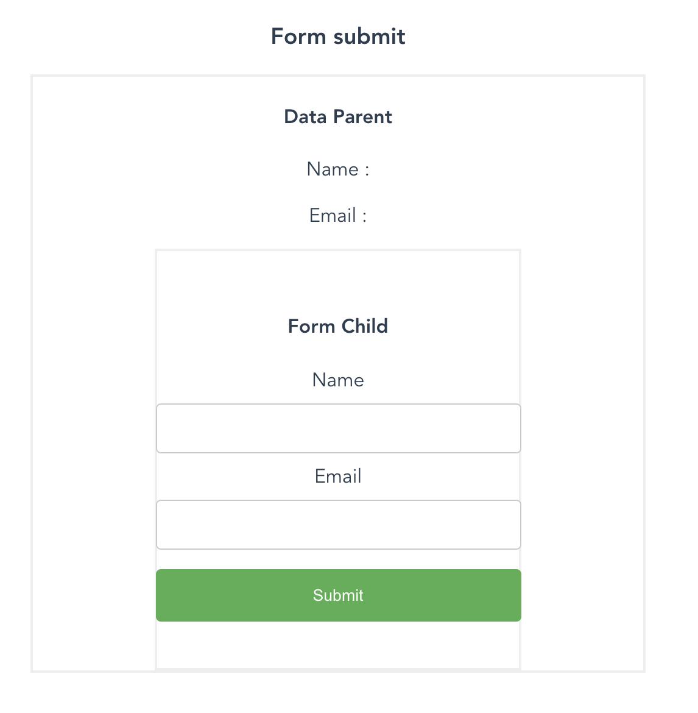

# vuejs-fundamental


## Project setup

```
npm install
npm run serve
npm run build
npm run lint
```

#### [CDN VUE](vue_cdn)

##### Pass Data and props


Parent to child use props

```javascript
<ChildComponent v-bind:childProp='data' />
```

Child to Parent use emit

```javascript
this.$emit('customerEvent', data);
```

Call child method use $ref

```javascript
<Child ref='refName' />;

this.$ref.refName.methodName();
```

### Methods vs Computed Vs watch

Method for Event , bind data , Rerender every time update
Computed for rerender when dependency update , bind data
Watch good for check varible change condition

#### Vue Summary

```
<p v-if="inStock">{{ product }}</p>
<p v-else-if="onSale">...</p>
<p v-else>...</p>

<div :class="{ active: isActive }">
<input v-model="firstName" >
<button @click="onClickEvent">
<form @submit.prevent="onSumbit">
<li v-for="item in items"
    :key="item.id">
  {{ item }}
</li>
<li v-for="(item, index) in items">
```

#### Practice app





### Vue Life Cycle

| Life Cycle    | Description                                  |
| ------------- | -------------------------------------------- |
| beforeCreate  | After the instance has been initialized      |
| created After | the instance is created                      |
| beforeMount   | Before the first render                      |
| mounted       | After the instance has been mounted          |
| beforeUpdate  | When data changes, before the DOM is patched |
| updated       | After a data change                          |
| beforeDestroy | Before the instance is destroyed             |
| destroyed     | After a Vue instance has been destroyed      |
